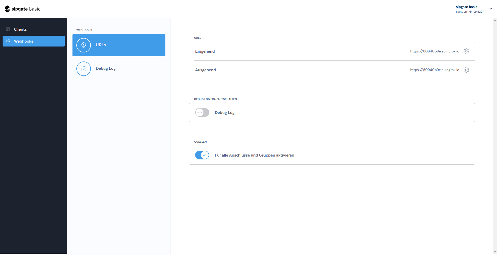
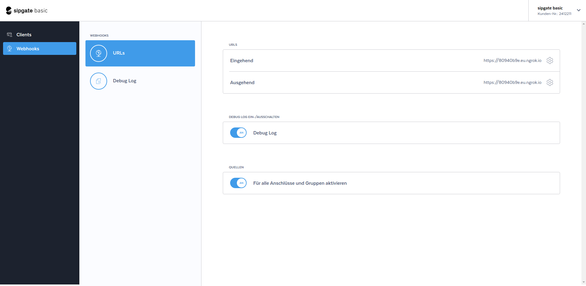
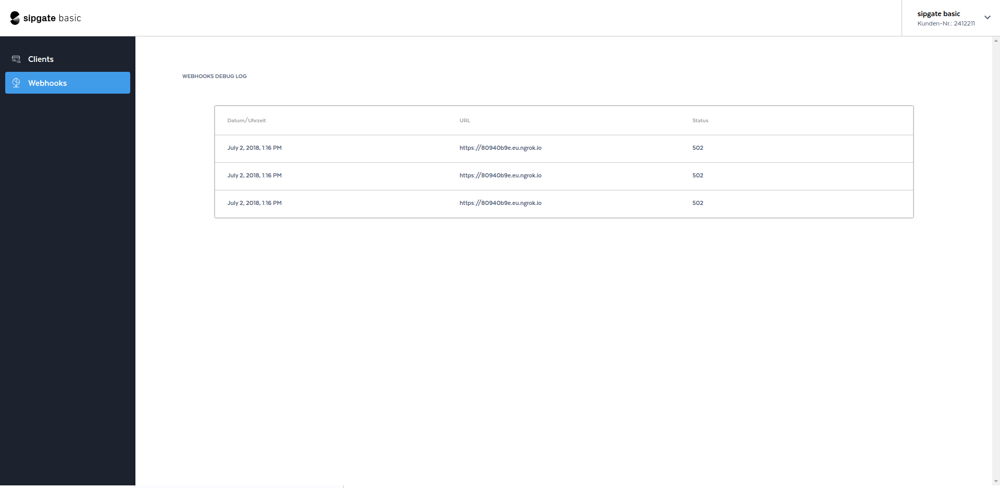

# Troubleshooting

## Enable debug log

You can enable logging for debugging purposes from your dashboard. You will find each request and the corresponding response in the logging table.



Click on "Activate debug log", read and confirm the security warning.



To view the logged requests, click on the icon within the "Activate debug log" row.




Your request should be logged and look like this.

### Inspect incoming network traffic

You can use `ngrep` to inspect incoming requests 
```bash
sudo ngrep -dany -Wbyline port 3000
```

The output should look like this
```
###
T 10.42.42.42:42528 -> 10.42.42.23:3000 [AP]
POST / HTTP/1.1.
Accept: application/xml, text/plain, text/html.
Accept-Charset: utf-8.
User-Agent: sipgate.io.
X-SIPGATE-JOBS: http://www.sipgate.de/jobs.
Content-Length: 84.
Content-Type: application/x-www-form-urlencoded; charset=UTF-8.
Accept-Encoding: gzip,deflate.
Host: gwen.fuglu.net:3000.
Via: 1.1 localhost (squid/3.1.20).
X-Forwarded-For: 217.10.77.113.
Cache-Control: max-age=259200.
Connection: keep-alive.
.

##
T 10.42.42.42:42528 -> 10.42.42.23:3000 [AP]
event=newCall&direction=in&from=anonymous&to=445603000514&callId=4932215337270853042
##
T 10.42.42.23:3000 -> 10.42.42.42:42528 [AP]
HTTP/1.1 200 OK.
X-Powered-By: Express.
Content-Type: application/xml; charset=utf-8.
Content-Length: 46.
Date: Tue, 23 May 2017 11:27:11 GMT.
Connection: keep-alive.
.
<Response><Dial><Voicemail/></Dial></Response>
#
``` 
